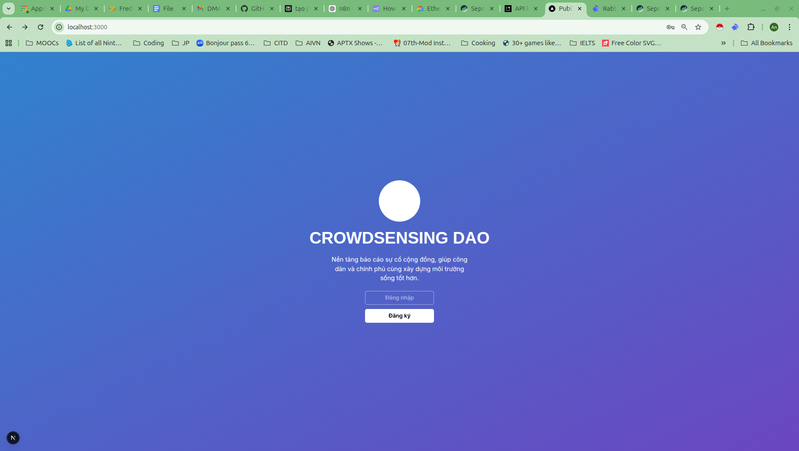
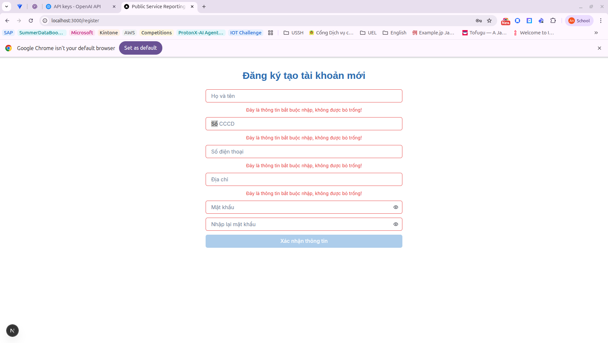
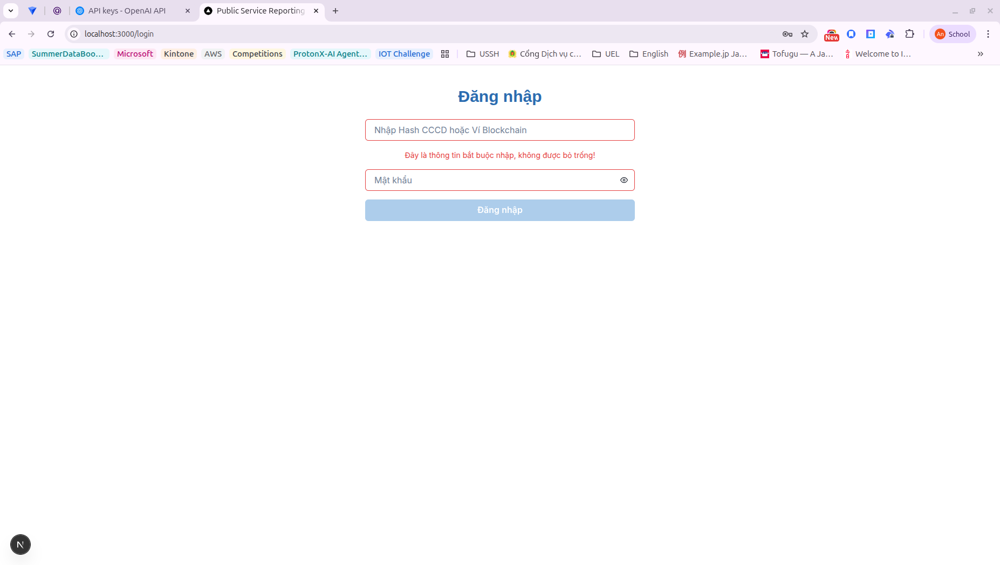
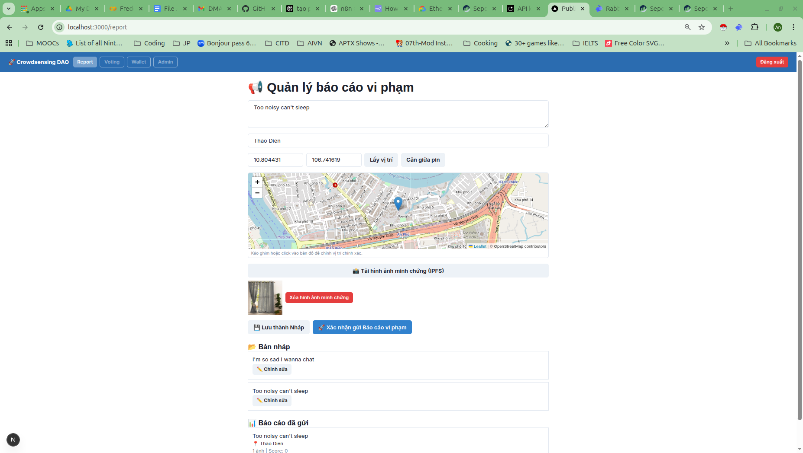
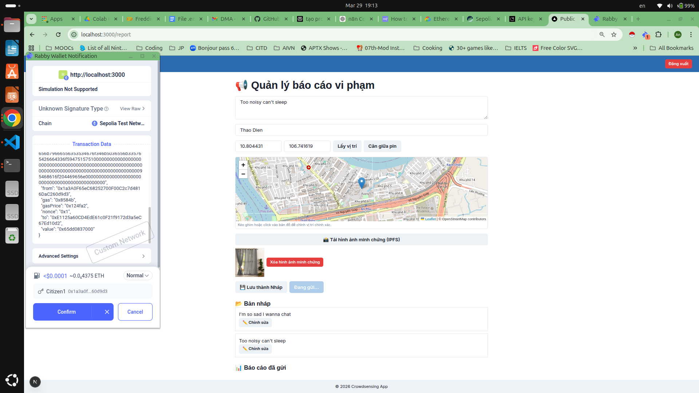
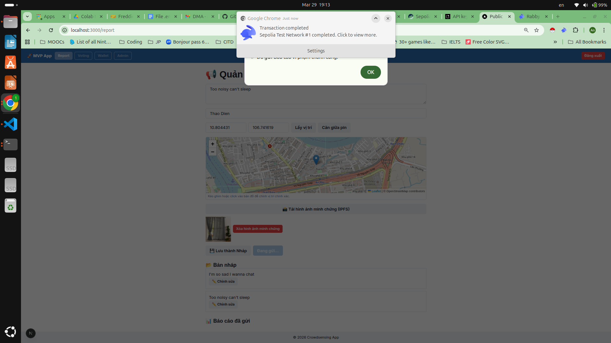
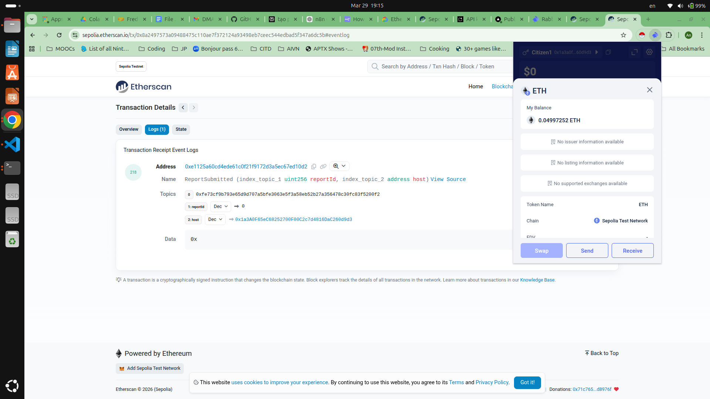
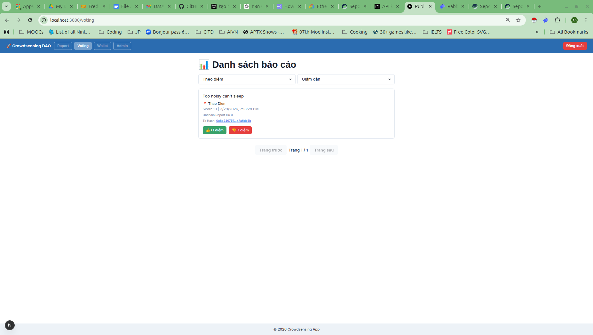
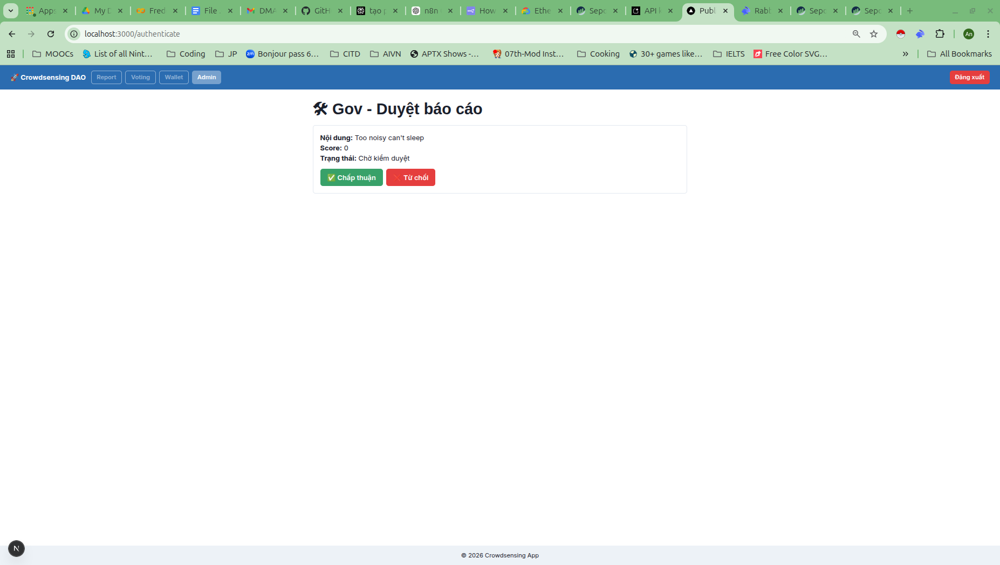
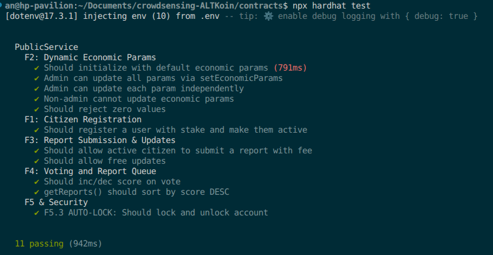

# Crowdsensing ALTKoin

Một nền tảng phản ánh vấn đề đô thị theo mô hình Web2 + Web3:
- Người dân gửi báo cáo kèm ảnh và vị trí.
- Báo cáo được lưu off-chain (DB/IPFS) và ghi dấu on-chain (Sepolia).
- Cộng đồng bỏ phiếu, quản trị viên duyệt, hệ thống thưởng/phạt stake minh bạch.

Mục tiêu của dự án là tạo niềm tin cho quy trình phản ánh hiện trường: dữ liệu có thể kiểm chứng, lịch sử xử lý rõ ràng, và cơ chế khuyến khích hành vi đúng.

---

## Demo

### 1) Landing page:


### 2) Đăng ký công dân: tạo tài khoản và gắn ví


### 3) Đăng nhập: xác thực để truy cập chức năng nghiệp vụ


### 4) Tạo báo cáo: mô tả vấn đề, vị trí, hình ảnh


### 5) Thanh toán phí báo cáo bằng ví (Sepolia)


### 6) Xác nhận gửi báo cáo: chuẩn bị dữ liệu trước khi ghi nhận


### 7) Gửi thành công: có thể truy vết transaction on-chain


### 8) Bỏ phiếu cộng đồng: ưu tiên xử lý theo điểm số


### 9) Góc quản trị: phê duyệt/từ chối và áp dụng thưởng-phạt


### 10) Kiểm thử hợp đồng thông minh


---

## Tech Stack

- **Frontend**: Next.js 16, React, TypeScript, Chakra UI
- **Backend API (trong Next.js App Router)**: Route Handlers
- **Database**: SQLite (`better-sqlite3`)
- **Smart Contract**: Solidity, Hardhat, Hardhat Ignition
- **Blockchain**: Ethereum Sepolia
- **Web3 client**: viem
- **Lưu ảnh/metadata**: IPFS (Pinata)

---

## Cấu trúc thư mục chính

```txt
.
├── contracts/   # Solidity + Hardhat + test + deployment
├── frontend/    # Next.js app (UI + API routes + local DB)
└── photos/      # Ảnh minh họa luồng sản phẩm
```

---

## Cài dependencies

### 1) Contracts

```bash
cd contracts
npm install
```

### 2) Frontend

```bash
cd frontend
npm install
```

---

## Cấu hình môi trường tối thiểu

### `contracts/.env`

```env
SEPOLIA_RPC_URL=https://eth-sepolia.g.alchemy.com/v2/<YOUR_KEY>
PRIVATE_KEY=0x<ADMIN_PRIVATE_KEY>
ETHERSCAN_API_KEY=<OPTIONAL_FOR_VERIFY>
```

### `frontend/.env.local`

```env
NEXT_PUBLIC_SEPOLIA_RPC=https://eth-sepolia.g.alchemy.com/v2/<YOUR_KEY>
NEXT_PUBLIC_PUBLIC_SERVICE_ADDRESS=0x<DEPLOYED_CONTRACT_ADDRESS>
NEXT_PUBLIC_REPORT_FEE_ETH=0.000007
NEXT_PUBLIC_STAKE_AMOUNT_ETH=0.00002

# Nếu dùng upload IPFS:
PINATA_JWT=<PINATA_JWT>
```

Lưu ý:
- Không commit private key hoặc JWT thật lên Git.
- Sau khi đổi `.env` / `.env.local`, hãy restart server.

---

## Test smart contract

```bash
cd contracts
npx hardhat test
```

---

## Deploy smart contract (Sepolia)

```bash
cd contracts
npx hardhat ignition deploy ./ignition/modules/deploy.cjs --network sepolia --reset
```

Sau deploy, lấy địa chỉ contract mới tại:
- `contracts/ignition/deployments/chain-11155111/deployed_addresses.json`

Rồi cập nhật:
- `frontend/.env.local` → `NEXT_PUBLIC_PUBLIC_SERVICE_ADDRESS=<new_address>`

---

## Chạy frontend local

```bash
cd frontend
npm run dev
```

Mở: `http://localhost:3000`

---

## Luồng demo nhanh

1. Đăng ký công dân.
2. Đăng nhập bằng tài khoản vừa tạo.
3. Tạo báo cáo có vị trí + ảnh.
4. Ký giao dịch gửi báo cáo trên Sepolia.
5. Vào trang voting để bỏ phiếu.
6. Đăng nhập admin để duyệt báo cáo và quan sát thưởng/phạt stake.

---

## Gợi ý vận hành

- Dùng cùng một mạng ví: **Sepolia**.
- Kiểm tra đủ ETH testnet cho admin/citizen trước khi test full flow.
- Nếu lỗi “wrong chain id”, chuyển ví sang Sepolia rồi thử lại.
